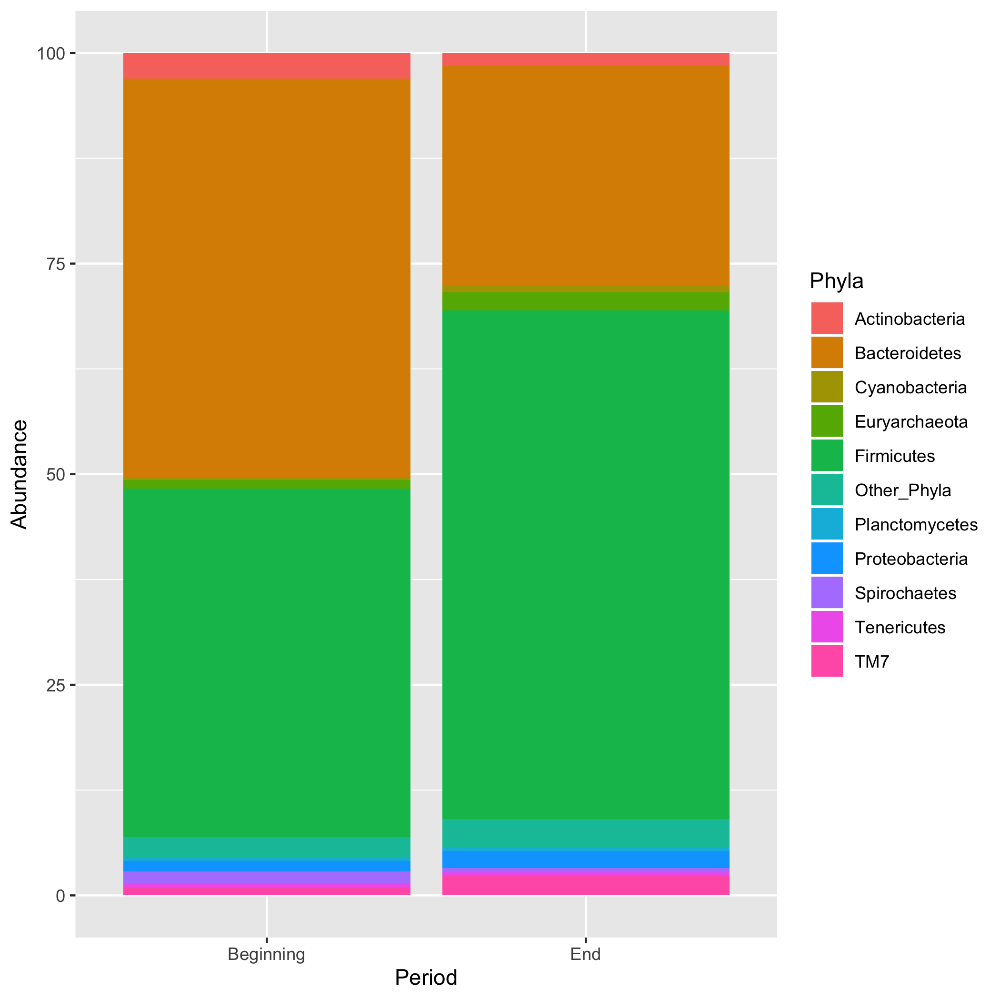
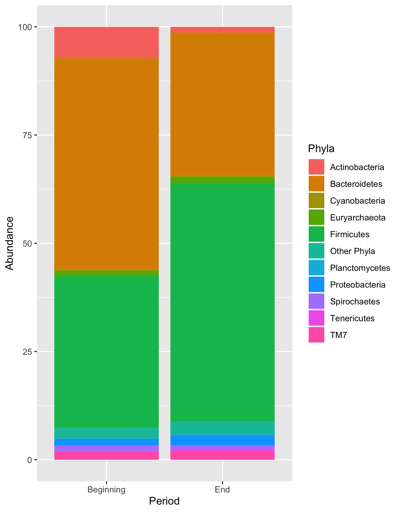
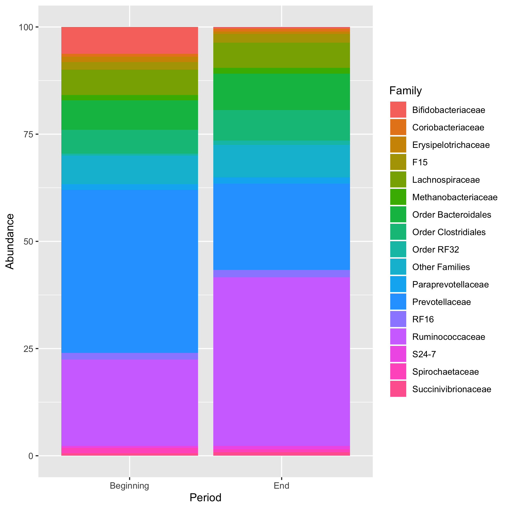
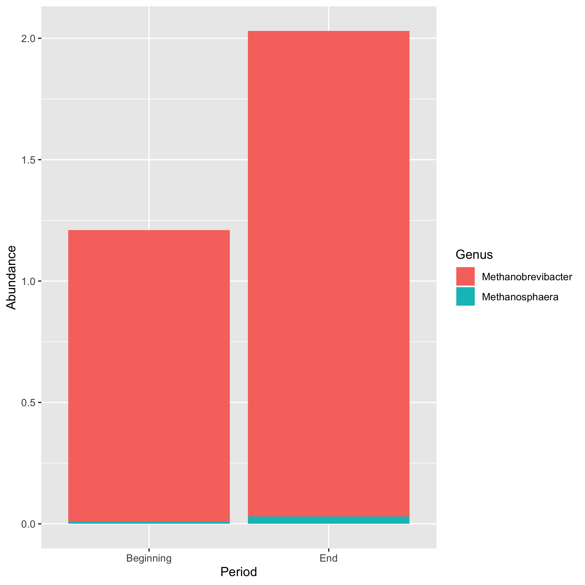
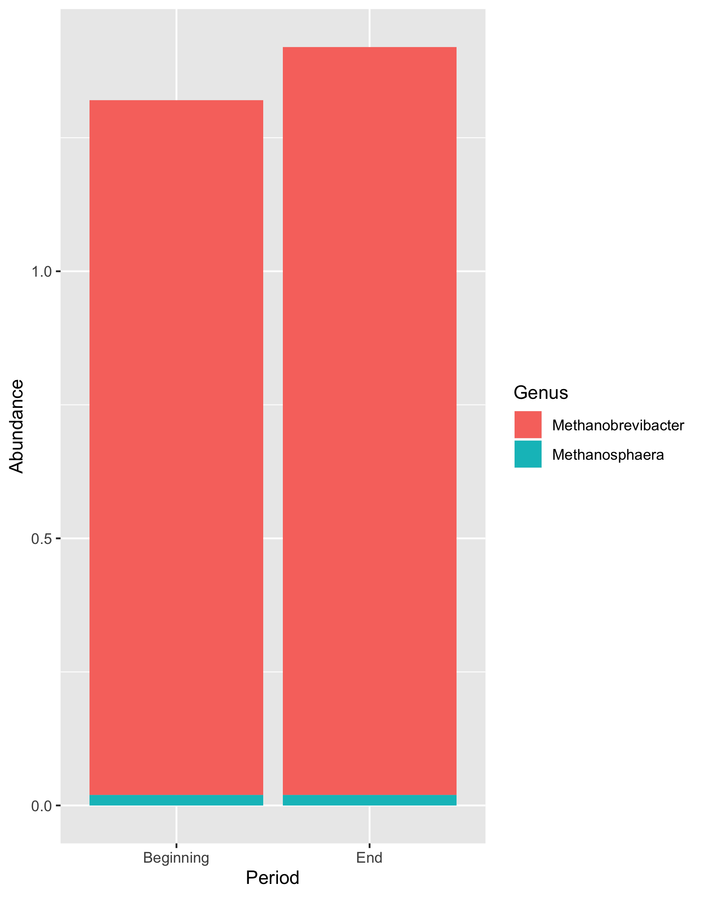

## Abstract
The ruminal microbiota of cattle allows them to convert low quality feedstuffs such as forages into higher quality human foods via microbial fermentation. The relative abundance and diversity of the resident microbiota changes throughout the course of the gastrointestinal tract, and this population contributes to the feed efficiency of cattle. This study assessed the relationship between cattle feed efficiency and their ruminal microbial populations during their feedlot period. A group of 65 Angus steers were fed a commercial finishing diet for 82 days and their growth performance was evaluated, including: dry matter intake (DMI), average daily gain ADG, and residual feed intake (RFI) using a Grow-Safe® system. Steers were ranked based upon their RFI, and the 5 lowest RFI (high efficiency) and 5 highest RFI (lowest efficiency) were selected.  Ruminal samples were collected at the beginning and end of the trial.
DNA was extracted from the samples, and the 16S rRNA gene was sequenced. There were no significant differences in ADG between the two groups of steers; however, the most efficient animals had a lower DMI and lower RFI. The less-efficient steers had a higher population of Methanobrevibacter in their rumens during the feedlot period and tended to have greater abundances of Methanosphaera. In the rumen of the high-efficient steers, abundance of Ruminococcaceae was significantly greater over the course of the study. These findings suggest that the most efficient steers had a microbial population that favored greater extent of fiber degradation in their rumens, which likely resulted in more energy harvested from their diets, and a more stable pH during the day, contributing to a better feed efficiency. Conversely, the increased abundances of the methanogenic archaea Methanobrevibacter and Methanosphaera in the less-efficient steers suggested that greater amounts of dietary energy were lost as methane in these steers, likely contributing to their lower feed efficiency.


## Introduction 
The symbiotic relationship between ruminant animals and their resident ruminal microbial consortium allows ruminants, such as cattle, to occupy a specific ecological niche because of their ability to convert fibrous feedstuffs into high quality food products via microbial fermentation. Because mammals do not produce fiber degrading enzymes, ruminants are entirely dependent on the  ability of the ruminal bacteria, fungi, and protozoa to degrade cellulose [1].  
Within the U.S Cattle Production industry, feedlots are the finishing stage for cattle with a focus on feeding a predominantly grain diet in favor of improved feed efficiency, and efficient bone and muscle tissue growth [2]. Cereal grains are a major energy source for cows due to their high concentrations of starch, a component that is almost completely and uniformly digested in the gastrointestinal tract when adequately processed [3]. Ultimately on a grain diet, energy density is increased and therefore production can be optimized in a well-managed intensive feedlot system [4]. Feed costs are the largest variable expense associated with producing beef cattle [5], accounting for approximately 75% of the cost of producing finished cattle [6]. Improving efficiency will both decrease feeding costs and decrease environmental impacts of beef and dairy production. Residual Average Daily Gain (RADG) is a feed efficiency selection tool adopted by the American Angus Association in their breeding selection programs because of its high degree of heritability [7]. RADG is heritable (~0.3 [8]), and it can be a predictor of a sire’s genetic ability for postweaning gain in future progeny compared to that of other sires, given a constant amount of feed consumed This allows producers to select for genetics that increase the efficiency of finishing cattle in a feedlot environment.  
Previous studies have shown a close association between the ruminal microbiota fermentation and cattle feed efficiency [9-11]. Therefore, the current study was designed to correlate the composition of the ruminal microbiome at the beginning and end of the feedlot phase with fermentation metabolites and growth efficiency measures of steers


# Description of data and data source
This study was conducted as a smaller portion of a larger study [4]. Briefly, for 5 offspring generations, commercial Angus cows were bred to determine the effect of selection based on RADG and marbling expected progeny differences (EPDs) on animal productivity, performance, and carcass quality. The current study utilized the fifth generation of steers born in that selection program and analyzed their performance in a feedlot-finishing system. The study was conducted on a commercial feedlot (Ridgefield Farm L.L.C.; Brasstown, North Carolina; 35.0391° N, 83.9576°W) from March 8, 2018 to May 29, 2018. A total of 65 steers were used, and of those 65 steers, 12 were selected based on their predicted EPDs. Of those 12 steers, the 5 most efficient and 5 least efficient according to residual feed intake (RFI) were selected for analysis of their ruminal microbiomes. Data was further processed 

# Questions/Hypotheses to be addressed
In my project I am trying to answer does the rumen microbiome change over the course of the feedlot period, what changes occur in the rumen microbiome of a feedlot cow on a high starch diet, and do those changes differ between groups (low-RFI and high-RFI) resulting in variance in and amongst the groups. Does selecting for heritable traits (RFI status) also relate to microbiome composition? It will be interesting to see the trends and how the microbial profile and end products change as the nutrient availability changes. In the rumen there are multiple classes of microbes, including fiber degrading, starch degrading, and methane producing bacteria. As the feedstuff changes, the abundance of specific microorganisms will as well, which dictate other outcomes as well, pH, VFA profile, ammonia production, and methane production. The implications of this study can aid in further manipulation of the diet and cow to improve feed efficiency, production costs, and envirornmental outputs. 

## Materials and Methods 

Animals, experimental design, and management

All procedures involving animals were verified and approved by the University of Georgia’s Office of Animal Care and Use (AUP #A2012 11-006-R1).

The experimental period had a duration of 82 days. Prior to that, steers were adapted to the finishing diet for 3 weeks. The diets were formulated to meet all nutrient requirements for growing cattle according to the NRC [5]. The composition of those diets is shown in Table 1. During the entire study, steers were fed using a GrowSafe Systems® (GrowSafe Systems Ltd., Calgary, Canada) for individual collection of feed intake. Steers were weighted at the beginning, mid-point, and end of the experimental period. Because the individual dry matter intake (DMI) and body weight gains were known for each steer, computation of RFI was possible. RFI was calculated as the difference between actual and expected DMI using linear regression of midpoint metabolic body weight and average daily gain (ADG).

Sample collection, DNA extraction and sequencing

Ruminal samples were collected 2 times – upon entering and exiting the feedlot – using the methodology described by [6]. All samples were immediately refrigerated and transported to the laboratory, where they were frozen and stored at -20°C until further processing. DNA was extracted from the rumen fluid samples according to the semi-automated extraction protocol described by [7]. Briefly, the procedure started with 0.5 mL of homogenized rumen fluid and achieved extraction of DNA through a combination of mechanic and enzymatic methods. The mechanic portion of the protocol used a FastPrep 24 Instrument (MP Biomedicals LLC, Irvine, CA, USA) to disrupt the cells. The enzymatic portion used InhibitEX® Tablets (QIAGEN, Venlo, Netherlands). Elution and purification of DNA were performed using an automated robotic workstation (QIAcube; QIAGEN, Venlo, Netherlands). Determination of DNA concentration and purity were performed spectrophotometrically using the Synergy™ H4 Hybrid Multi-Mode Microplate Reader (BioTek Instruments Inc; Winooski, VT, USA). After DNA extraction, samples were taken to the Georgia Genomics and Bioinformatics Core facility (https://dna.uga.edu) for library preparation and 16S rRNA gene sequencing. Library preparation included PCR replications using the forward: S-D-Bact-0341-b-S-17 (5′-CCTACGGGNGGCWGCAG-3′); and reverse: S-D-Bact-0785-a-A-21 (5′-GACTACHVGGGTATCTAATCC-3′) primer pair [8]. Samples were sequenced using the Illumina MiSeq system (Illumina Inc., San Diego, CA, USA).

Sequencing data 

Sequencing data were demultiplexed and downloaded as FASTQ files. Pair-end reads were merged using BBMerge Paired Read Merger v37.64, and files were further analyzed using the QIIME pipeline v1.9.1 [9]. Files were converted into FASTA files and quality-filtered. The sequences were clustered into operational taxonomic units (OTUs) at 97% similarity according to the Greengenes database. Singleton OTUs were excluded from the analysis. A sampling depth of 28,662 sequences per sample was used for the diversity analyses. The computed alpha-diversity indexes were: number of observed OTUs, Chao1, species evenness, Shannon index, and Faith’s phylogenetic diversity.

Statistical Analysis

# Data aquisition
The data described was collected from a total of 65 steers, and of those 65 steers, 12 were selected based on their predicted EPDs. Of those 12 steers, the 5 most efficient and 5 least efficient according to residual feed intake (RFI) were selected for analysis of their ruminal microbiomes. Each file for the raw data is located within file ./data/raw_data.csv. 

# Data import and cleaning
The data is imported from multiple .csv files. For both Low-RFI and High-RFI there are 11 observations from phyla, _Firmicutes, Bacteroidetes, Actinobacteria, TM7, Proteobacteria, Euryarchaeota, Spirochaetes, Cyanobacteria, Tenericutes, Planctomycetes, and Other Phyla_. For the High-RFI group there are 18 observations for familes, _Ruminococcaceae, Prevotellaceae, Order Clostridiales, Order Bacteroidales, Lachnospiraceae, RF16, Methanobacteriaceae, F16, Paraprevotellaceae, S24-7, Coriobacteriaceae, Erysipelotrichaceae*, Bifidobacteriaceae, Spirochaetaceae, Streptococcaceae, Mogibacteriaceae, Succinivibrionaceae, Other Families_. While in the Low RFI group there are 17 observations, _Ruminococcaceae*, Prevotellaceae, Order Bacteroidales, Order Clostridiales, Lachnospiraceae, Bifidobacteriaceae, F16, RF16, Paraprevotellaceae, Methanobacteriaceae, Spirochaetaceae, Erysipelotrichaceae, Coriobacteriaceae, Succinivibrionaceae, Order RF32, S24-7, Other Families_. In both High-RFI and Low-RFI steers we isolated 2 observations from archeal speacies, _Methanobrevibacter, Methanosphaera_. After the data was imported, missing values were removed, and columns were renamed. Barcharts were made for each individual time period to combine them in a graph that displayed changes overtime for each observation. 


## Results and Discussion 
```{r setup, include=FALSE}
library(here)
source(here("./code/processing_code/processingscript.R"))

```
# Animal Performance 
Feedlot cattle are typically fed high grain rations to maximize their rate of gain, as well as to increase intramuscular marbling and carcass quality (REF).  Grain diets utilize typically contain corn, which is high in starch, an easily fermentable carbohydrate that can alter the microbial population composition of the rumen REF. Performance and efficiency of each steer were individually assessed throughout the 82 d feedlot period by measuring DMI, ADG, feed:gain ratio, RFI, and subsequently using information on carcass traits such as hot carcass weights (HCW) and carcass marbling scores (Table 1). The most efficient steers (low-RFI) had a lower average DMI than did the least efficient (high-RFI). In addition, the average difference in RFI between the least and the most efficient groups was 1.85 kg DMI/day. It was expected that more efficient animals would have a lower DMI and lower RFI, which has been seen in both dairy and beef cattle [18]. Differences in feed efficiency occur due to many factors, including ruminal and gastrointestinal production of methane, and feed intake levels affect methane production [19]. Ruminal methane production can represent a loss of Carbon and energy up to 12% of the dietary energy to the animal.  Therefore, in the current study, the higher proportion of methane-producing microorganisms detected in the rumen of high-RFI (lower efficiency) steers at the end of the feedlot period (Figure 5, Figure 6; discussed in more detail below) was possibly related to their lower feed efficiency. Moreover, more efficient animals (low-RFI) had a lower feed:gain ratio than did the lower efficiency animals (high-RFI), although this was not statistically significant. Marbling scores, HCW, and ADG were very similar between the two groups of steers. 

```{r warning=FALSE, echo=FALSE}

library(ggplot2)
library(dplyr)
library(pander)
linearMod3table <- readRDS(here("././results/linearMod3table.rds"))
animalPerformance <- readRDS(here("././data/processed_data/processed_data_animal_performance.rds"))

animalPerformance <- na.omit(animalPerformance)

pander(animalPerformance)
pander(linearMod3table)


```

_Table 1. Animal performance data observed during the finishing period according to Residual Feed Intake (RFI) classification in feedlot steers (n=5/group)_


# Bacterial Populations 

```{r warning=FALSE, echo=FALSE, fig.cap= "Bacterial abundance at the phyla level in ruminal samples collected at the beginning and end of the feedlot period in high-RFI steers"}


```


```{r warning=FALSE, echo=FALSE, fig.cap= "Bacterial abundance at the phyla level in ruminal samples collected at the beginning and end of the feedlot period in Low-RFI steers"}



```


Rumen fluid samples identified 10 phyla with relative abundance equal or greater than 0.2% in both high-RFI (low efficiency) and low-RFI (high efficiency) steers (Figure 1, Figure 2). The relative abundance of predominant phyla varied both over the course of the feedlot period, as well as between high- and low-RFI steers. At the beginning of the feedlot period, Bacteroidetes, Firmicutes, and Actinobacteria were the most predominant phyla for both high- and low-RFI steers, accounting for more than 90% of the total OTU in these steers. However, at the end of the feedlot period, the top 3 phyla were Firmicutes, followed by Bacteroidetes and Proteobacteria, composing more than 90% of the OTU.

The populations of Firmicutes in the most efficient animals (i.e. low-RFI) increased by the end of the feedlot period (Figure 2); however, a similar increase occurred in the least efficient animals (high-RFI), although this increase was not as extensive (Figure 1). Additionally, there was a decrease in the abundance of Bacteroidetes in the rumen of least efficient animals during the feedlot period. Interestingly, a lower phylum with a lower abundance in the rumen, Euryarchaeota, was significantly higher  in the least efficient steers (Figure 1).The phylum Euryarchaeota contains a diverse group of obligate anaerobic methanogens [20]. An increase in the abundance of Euryarchaeota subsequently resulted in an increase in families Methanobrevibacter and Methanosphaera within this phylum.

Prevotellaceae was the most prevalent family identified in both groups of steers at the beginning of the feedlot period, with relative abundances averaging 37 to 38% of the total population for both RFI groups (Figure 3, Figure 4). However, at the end of the feedlot period, Prevotellaceae were significantly decreased in the rumen of both high- and low-RFI steers (to 14 and 20%, respectively; Figure 1).  The family Prevotellacea consists of amylolytic gram negative bacterium that proliferate rapidly in the presence of high-starch diets such as feedlot diets [22] [23] [24]. Thus, the decrease of Prevotellaceae observed in both groups of steers during the feedlot phase when cattle were fed a high starch containing diet was unexpected. However, the family Ruminococcaceae contains ruminal fiber degrading bacteria [25]; [26]),  and the abundance of Ruminococcaceae numerically increased in both groups of steers, which could mitigatethe potential negative effects of low rumen pH. Ruminococcaceae were increased in the most efficient animals (Figure 4), whereas, in the least efficient animals, this increase was less extensive. We suggest that pH stabilization which allowed more extensive fiber degradation to occur, could be one of the mechanisms leading to the difference in the efficiency groups.

```{r warning=FALSE, echo=FALSE, fig.cap= "Bacterial abundance at the family level in ruminal samples collected at the beginning and end of the feedlot period in High-RFI steers"}

knitr::include_graphics("../../results/Highfamilycomb.png")

```

```{r warning=FALSE, echo=FALSE, fig.cap= "Bacterial abundance at the family level in ruminal samples collected at the beginning and end of the feedlot period in Low-RFI steers"}



```

More changes occurred at the family level throughout the feedlot period, but these changes occurred in bacterial families with smaller relative populations and were limited to occurring in the least efficient (high-RFI) steers. For example, the abundance of Erysipelotrichaceae decreased (beginning: 1.2%, end: 0.7%, while the family Methanobacteriaceae decreased in abundance (beginning: 1.2%, end: 2.0%). Although Methanobacteriaceae and Erysipelotrichaceae have lower abundances in the rumen, the drastic decrease in Prevotellaceae, could have been enough to impact these populations by opening a niche for occupation. Populations that comprise small proportions of the overall ruminal population (e.g.,  methanogenic archaea), are more sensitive to changes in diversity and richness [27].

Two archaeal genera were identified in the rumen of the present steers in the feedlot: Methanobrevibacter and Methanosphaera. In the least efficient steers (high-RFI), there was an increase in Methanobrevibacter  and in Methanosphaera during the feedlot period (Figure 5, Figure 6). In the most efficient (low-RFI) steers however, the changes in Methanobrevibacter and Methanosphaera populations were not significant. Archaea are metabolically diverse organisms that in the rumen live along with bacteria and protozoa by providing a reducing equivalent sink that allows NADH to be regenerated in the highly reduced ruminal environment [28]. In addition to volatile fatty acids (VFA), the ruminal microbial fermentation also produces H2, CO2, and CH4, which are not utilized by the host [29]. Methane is released by the animal primarily through eructation and can be a loss of up to 5-7% of the dietary feed energy to cattle [30, 31]. Thus, this potent greenhouse gas poses an environmental threat and negatively impacts the productivity of the host since it is literally a waste of energy. Therefore, ruminal Methanobrevibacter and Methanosphaera populations having the greatest increase in the least efficient steers (high-RFI) indicated that there was probably a greater waste of their energy intake in the form of methane, contributing to their poorer feed efficiency.

```{r warning=FALSE, echo=FALSE, fig.cap= "Bacterial abundance at the genus level in ruminal samples collected at the beginning and end of the feedlot period in High-RFI steers"}



```

```{r warning=FALSE, echo=FALSE, fig.cap= "Bacterial abundance at the genus level in ruminal samples collected at the beginning and end of the feedlot period in Low-RFI steers"}



```

# Univariate analysis: Alpha Diversity 

The number of observed OTUs increased numerically in both low and high RFI groups during the feedlot period, however, those differences were not statistically significant (Table 4). The Chao1 index was also increased in both groups of steers during the feedlot phase, especially in high-RFI steers, for which a trend compared with low-RFI steers . The Chao1 index estimates microbial diversity while accounting for rare species present [32]. Therefore, the trend observed in the high-RFI steers may be a result of the increased methanogenic archaea observed in this group, which are relatively low in abundance. Microbial diversity expressed as Shannon index had increased ruminal diversity in high-RFI steers at the end of the feedlot phase, whereas, no differences were observed in low-RFI steers. Faith’s Phylogenetic Diversity index measures the phylogenetic history of taxa in a sample [33], and. did not indicate differences for either group of steers across the feedlot period.

```{r warning=FALSE, echo=FALSE}

library(ggplot2)
library(dplyr)
library(pander)

alpha_diversity_high <- readRDS(here("./data/processed_data/processed_data_alpha_diversity_hi.rds"))
linearMod1table <- readRDS(here("././results/linearMod1table.rds"))

alpha_diversity_high <- na.omit(alpha_diversity_high)

pander(alpha_diversity_high)
pander(linearMod1table)


```

_Table 2. Alpha diversity metrics observed during the finishing period according to High-Residual Feed Intake (RFI) classification_


```{r warning=FALSE, echo=FALSE}

library(ggplot2)
library(dplyr)
library(pander)


alpha_diversity_low <- readRDS(here("./data/processed_data/processed_data_alpha_diversity_low.rds"))

linearMod1table <- readRDS(here("././results/linearMod1table.rds"))
modelSummarytable <- readRDS(here("././results/modelSummarytable.rds"))

alpha_diversity_low <- na.omit(alpha_diversity_high)

pander(alpha_diversity_low)
pander(modelSummarytable)

```


_Table 3. Alpha diversity metrics observed during the finishing period according to Low-Residual Feed Intake (RFI) classification_


# Bivariate analysis: ANOVA and Linear Models


Question: Did the microbiome experience change over the course of the feedlot period? Did RFI status have an effect on this change? 
The changes in the abundance of phyla over the duration of the feedlot period are difficult to view in Fig. 1 and Fig.2. To take a closer look at the relation between period and RFI group, factors beginning, end, and phyla will be analyzed using a linear fit model and ANOVA. 

```{r phylahigh.aovsummary, warning=FALSE, echo=FALSE, fig.cap= "_Table 6. Bacterial abundance* (phyla level) observed at the beginning and end of the finishing period for high-residual feed intake (RFI) Angus steers (n = 5 steers). *Only phyla with average abundance ≥ 0.2% are shown"}

phylahigh_aov_table <- readRDS(here("./results/phylahigh_aov_table.rds"))
pander(phylahigh_aov_table)


```

```{r phylahigh.aovsummary2, warning=FALSE, echo=FALSE, fig.cap= "_Table 7. Bacterial abundance* (phyla level) observed at the beginning and end of the finishing period for low-residual feed intake (RFI) Angus steers (n = 5 steers). *Only phyla with average abundance ≥ 0.2% are shown"}

phylalow.aovsummary2 <- readRDS(here("./results/phyla_low_aov_table.rds"))
pander(phylalow.aovsummary2)
```

ANOVA allows us to see that there is variance between the bacterial abundance at beginning and end of the feedlot period in High-RFI steers (Table 2, Table 3). This indicates that the microbiome did experieience changes over the course of the feedlot period. There is also an idication that high-RFI cows had more variance in their data set and possibly experienced more change over time due to their RFI status.  


```{r linearMod.1table, echo=FALSE, warning=FALSE}

linearMod.1table <- readRDS(here("././results/linearMod_1table.rds"))
pander(linearMod.1table)
```
_Table 8A. Linear Model in High RFI-steers, bacterial abundance verses time period._

```{r linearMod.2table, echo=FALSE, warning=FALSE}

linearMod.2table <- readRDS(here("././results/linearMod_2table.rds"))
pander(linearMod.2table)

```
_Table 8B. Linear Model in Low RFI-steers, bacterial abundance verses time period._


## Full analysis
# K- Means Cluster Analysis

Clustering helps find subgroups of observations within a data set. By clustering observations, the desired outcome is to have observations in the same group to be similar and observations in different groups to be dissimilar. Therefor, this method seeks to find relationships between the observations without being trained by a response variable. Finally clustering allows the idenification of which observations are alike and further categorize them.

Question: Does RFI status affect bacterial abundance over time? Will there be distinct clusters specific to each RFI group as time progresses?


```{r, echo=FALSE, warning=FALSE }

library(tidyverse)
library(factoextra)
library(FactoMineR)
library(cluster)
library(ggplot2)
library(dplyr)
library(pander)

#phylum
phyla.all1 <- readRDS(here("././results/phyla.all1.rds"))
phyladistance <- readRDS(here("././results/phyladistance.rds"))
K1 <- readRDS(here("././results/K1.rds"))
hc.phyla <- readRDS(here("././results/hc.phyla.rds"))

#family
family.all1 <- readRDS(here("././results/family.all1.rds"))
familydistance <- readRDS(here("././results/familydistance.rds"))
K2 <- readRDS(here("././results/K2.rds"))
hc.family <- readRDS(here("././results/hc.family.rds"))

#genera
genus.all1 <- readRDS(here("././results/genus.all1.rds"))
genusdistance <- readRDS(here("././results/genusdistance.rds"))
K3 <- readRDS(here("././results/K3.rds"))
hc.genus <- readRDS(here("././results/K3.rds"))

#all
all.km <- readRDS(here("././results/all.km.rds"))
all.dist <- readRDS(here("././results/all.dist.rds"))
all.gap <- readRDS(here("././results/all.gap.rds"))
all.hsil <-readRDS(here("././results/all.hsil.rds"))
all.sil <- readRDS(here("././results/all.sil.rds"))
all.hier <- readRDS(here("././results/all.hier.rds"))
all.hsp <-readRDS(here("././results/all.hsp.rds"))


```


```{r, all.gap, echo=FALSE, warning=FALSE, fig.cap= "Gap Statistic for Phyla, Family, and Genera" }
knitr::include_graphics("././results/all.gap.png")
plot(all.gap)
```
The gap statistic is calculated to determine the optimal number of clusters the K-Means Cluster should have. A 10,5, and 3 cluster solution are offered for Phyla, Family, and Genera. Family and phyla appear to be highly clustered compared to gerera. 


```{r, all.km, echo=FALSE, warning=FALSE, fig.cap= "K-means Clusters for Phyla, Family, and Genera."}

knitr::include_graphics("././results/all.km.png")
plot(all.km)


```
The Hopkins statistic was also calculated for each level (supplementmats.RMD). We can conduct the Hopkins Statistic test iteratively, using 0.5 as the threshold to reject the alternative hypothesis. That is, if H < 0.5, then it is unlikely that a bacterial class has statistically significant clusters. If the value of Hopkins statistic is close to 1, then we can reject the null hypothesis and conclude that the dataset is significantly a clusterable data. The value of the Hopkins statistic was significant for Phyla < 0.5 (0.94368), and Family < 0.5 (0.9490412). However the Hopkins statistic was > 0.5 (0.4842) for Genera, indicating that genera aren't significantly significant. Also, this could be due to the smaller dataset for genera opposed to family and phyla. It does appear that bacterial abundance over time is clustered with its prospective RFI group. 

```{r, all.sil, echo=FALSE, warning=FALSE, fig.cap= "Silhouette Measures for Phyla and Genera"}
knitr::include_graphics("././results/all.sil.png")
plot(all.sil)
```
 Silhouette measures _(Si)_ how similar an object _(i)_ is to the the other objects in its own cluster versus those in the neighbor cluster. Silouette values range from 1 to - 1:  A value of _Si_ close to 1 indicates that the object is well clustered. In the other words, _i_ is similar to the other objects in its group. A value of _Si_ close to -1 indicates that the object is poorly clustered, and that assignment to some other cluster would probably improve the overall results.
Both phyla and family have average _Si_ of >0.7 indicating that their objects within the clusters are very similar. The _Si_ that are zero in both bacterial levels are due to one bacterial group found in one RFI group and not another. 


Although genera had a lower Hopkins Statistic, it can be concluded for phyla and family RFI status can effect bacterial abundance over time. Bacteria tended to have different trends based on RFI classification. 

```{r, echo=FALSE, warning=FALSE}
library(huxtable)
library(ggstance)
library(factoextra)
library(FactoMineR)
library(cluster)

F2 <- readRDS(file = here("././results/F2.rds"))
F1 <- readRDS(file = here("././results/F1.rds"))
mod2sum <- readRDS(file = here("././results/mod2sum.rds"))
mod1sum <- readRDS(file = here("././results/mod1sum.rds"))
plotmod2 <- readRDS(file= here("././results/plotmod2.rds"))
plotmod2sum <- readRDS(file = here("././results/plotmod2sum.rds"))
plotmod2sum2 <- readRDS(file = here("././results/plotmod2sum2.rds"))
expmod2.3 <- readRDS(file = here("././results/expmod2.3.rds"))


```


# Linear Regression Model


Simple Linear Regression: Abundance difference ~ RFI Status
Question: How does bacterial abundance over time change based on RFI Status?


```{r, mod1sum, echo=FALSE, warning=FALSE, fig.cap= "Linear regression model for the relationship between the change in phyla bacterial abundance and RFI status"}

mod1sum <- readRDS(file = here("././results/mod1sum.rds"))
pander(mod1sum)
```
In order to get a better insight on this model, a multiple regression model might be more appropiate. 


Multiple Linear Regression: Abundance_Difference ~ RFI_Status + Bacterial.Family
```{r, mod2sum, echo=FALSE, warning=FALSE, fig.cap= "Multiple Regression Model for the relationship of Bacterial Family, RFI status, and the change in bacterial abundance over time"}
mod2sum <- readRDS(file = here("././results/mod2sum.rds"))
pander(mod2sum)

```
Approximately 98% of variation in family abundance over time can be explained by RFI status and classification of bacterial families. 


Ploting Multiple Regression Model: Abundance_Difference ~ RFI_Status + Bacterial.Family
```{r, plotmod2, echo=FALSE, warning=FALSE, fig.cap= "Fig. Differing scales of the varibles in model" }
plotmod2 <- readRDS(file= here("././results/plotmod2.rds"))
plot(plotmod2)
```


```{r, expmod2.3, echo=FALSE, warning=FALSE, fig.cap= "Table outputs of Multiple Regression Model: Abundance_Difference ~ RFI_Status + Bacterial.Family" }

expmod2.3 <- readRDS(file = here("././results/expmod2.3.rds"))
view(expmod2.3)


```


Although the regression model fit the data, lets try another model as an option as well. 
# Looking at other models: Logistic Regression Model
```{r, echo=FALSE, warning=FALSE}
mod3sum <- readRDS(file = here("././results/mod3sum.rds"))
mod4sum <- readRDS(file = here("././results/mod4sum.rds"))
mod5sum <- readRDS(file = here("././results/mod5sum.rds"))
```

```{r, mod3sum, echo=FALSE, warning=FALSE, fig.cap= "Logistic Regression Model: RFI_Status ~ Abundance_Difference"}

mod3sum <- readRDS(file = here("././results/mod3sum.rds"))
pander(mod3sum)
```


```{r, mod5sum, echo=FALSE, warning=FALSE, fig.cap="Logistic Regression Model: RFI_Status ~ Family + Abundance_Difference + Bacterial.Family" }
mod5sum <- readRDS(file = here("././results/mod5sum.rds"))
pander(mod5sum)

```
The linear regression model seemed to fit the data best and answer the questions presented by this data set. 


## Summary and Interpretation
In my statistical analysis I looked at bacterial abundance verses time period. ANOVA allows us to see that there is variance between the bacterial abundance at beginning and end of the feedlot period in High-RFI steers and Low-RFI steers (Table 6, Table 7). This indicates that the microbiome did experieience changes over the course of the feedlot period. In my supplemental materials file I also looked at the correlation bewteen factors, we can see that there is a high positive correlation between the change from the beginning of the feedlot period to the end of the feeddlot period for phyla in each group. Therefore the correlation between them will be closer to 1, as shown to be .88 in this analysis. The shifts in the microbiome differ between the RFI groups, which is indictive that microbial composition can effect animal performance. 

## Strengths and Limitations
A limitation of this analysis occured due to the small sampling size of steers. RFI status was predetermined with genetic analysis, but upon data collection, the genetic analysis was different. This resulted in the smaller sample size of n=10. A larger sample size could've allowed greater differences between the groups. 

## Conclusions
Animal performance is impacted by shifts in the microbial composition in the rumen. Despite the limitations in sample size in the present study, we observed an increase Ruminococcaceae in the rumen of the most efficient steers (low-RFI), suggesting that a greater extent of fiber degradation could be expected in the rumen of those animals, which may in turn have resulted in a more stable pH. All the observed changes in the microbial populations provided a healthier ruminal environment and would result in potentially more energy harvested from the diet by the symbiosis of the microbial population and the steers, allowing those steers to be more efficient. Conversely, the less efficient steers had an increased population of the methanogenic archaea Methanobrevibacter and Methanosphaera during their feedlot period, suggesting that a greater waste of energy as ruminal methane, compared to the most efficient steers. Further studies should be conducted to investigate the smaller microbial populations to more deeply understand the rumen microbiome holistically and how it changes over time during different production periods and diets. As we develop a more comprehensive understanding of the rumen microbiome and its function and impact on the animal, further advancements can be made towards decreasing production costs, improving management strategies, and increasing energetic efficiency.


# References
1.	Russell, J.B. and J.L. Rychlik, Factors that alter rumen microbial ecology. Science, 2001. 292(5519): p. 1119-22.
2.	Service, U.S.D.o.A.E.R. Cattle and Beef: Sector at a Glance 2019; Available from: https://www.ers.usda.gov/topics/animal-products/cattle-beef/.
3.	Nocek, J.E. and S. Tamminga, Site of Digestion of Starch in the Gastrointestinal Tract of Dairy Cows and Its Effect on Milk Yield and Composition. 1991. 74(10): p. 3598-3629.
4.	Huntington, G.B., Starch utilization by ruminants: from basics to the bunk. Journal of Animal Science, 1997. 75(3): p. 852.
5.	Lancaster, P.A., et al., Phenotypic and genetic relationships of residual feed intake with performance and ultrasound carcass traits in Brangus heifers1. Journal of Animal Science, 2009. 87(12): p. 3887-3896.
6.	Hill, R.A., Feed Efficiency in the Beef Industry. 2012, Somerset, UNITED STATES: John Wiley & Sons, Incorporated.
7.	Sally North, B.B., American Angus Association. By the Numbers. Angus feed efficiency selection tool: RADG 2010; Available from: http://www.angus.org/nce/documents/bythenumbersradg.pdf.
8.	Association, A.A. Angus National Cattle Evaluations Fall 2019. 2019; Available from: http://www.angus.org/Nce/Heritabilities.aspx.
9.	Hernandez-Sanabria, E., et al., Impact of Feed Efficiency and Diet on Adaptive Variations in the Bacterial Community in the Rumen Fluid of Cattle. Applied and Environmental Microbiology, 2012. 78(4): p. 1203-1214.
10.	Nkrumah, J.D., et al., Relationships of feedlot feed efficiency, performance, and feeding behavior with metabolic rate, methane production, and energy partitioning in beef cattle1. Journal of Animal Science, 2006. 84(1): p. 145-153.
11.	Shabat, S.K.B., et al., Specific microbiome-dependent mechanisms underlie the energy harvest efficiency of ruminants. The ISME Journal, 2016. 10(12): p. 2958-2972.
12.	Detweiler, R.A., et al., The impact of selection using residual average daily gain and marbling EPDs on growth, performance, and carcass traits in Angus steers1. J Anim Sci, 2019. 97(6): p. 2450-2459.
13.	Council, N.R., Nutrient Requirements of Beef Cattle: Seventh Revised Edition: Update 2000. 2000, Washington, DC: The National Academies Press. 248.
14.	Lourenco, J.M., et al., Analysis of the Rumen Microbiota of Beef Calves Supplemented During the Suckling Phase. Frontiers in Microbiology, 2019. 10(1131).
15.	Rothrock, M.J., Jr., et al., A hybrid DNA extraction method for the qualitative and quantitative assessment of bacterial communities from poultry production samples. J Vis Exp, 2014(94).
16.	Klindworth, A., et al., Evaluation of general 16S ribosomal RNA gene PCR primers for classical and next-generation sequencing-based diversity studies. Nucleic Acids Res, 2013. 41(1): p. e1.
17.	Caporaso, J.G., et al., QIIME allows analysis of high-throughput community sequencing data. Nat Methods, 2010. 7(5): p. 335-6.
18.	Elolimy, A.A., et al., Residual feed intake in beef cattle and its association with carcass traits, ruminal solid-fraction bacteria, and epithelium gene expression. J Anim Sci Biotechnol, 2018. 9: p. 67.
19.	Johnson, K.A. and D.E. Johnson, Methane emissions from cattle. J Anim Sci, 1995. 73(8): p. 2483-92.
20.	Holmes, D.E. and J.A. Smith, Biologically Produced Methane as a Renewable Energy Source. 2016, Elsevier. p. 1-61.
21.	Turnbaugh, P.J., et al., An obesity-associated gut microbiome with increased capacity for energy harvest. Nature, 2006. 444: p. 1027.
22.	Mackie, R.I. and F.M. Gilchrist, Changes in Lactate-Producing and Lactate-Utilizing Bacteria in Relation to pH in the Rumen of Sheep During Stepwise Adaptation to a High-Concentrate Diet. Appl Environ Microbiol, 1979. 38(3): p. 422-30.
23.	Goad, D.W., C.L. Goad, and T.G. Nagaraja, Ruminal microbial and fermentative changes associated with experimentally induced subacute acidosis in steers. J Anim Sci, 1998. 76(1): p. 234-41.
24.	Slyter, L.L., Ability of pH-Selected Mixed Ruminal Microbial Populations to Digest Fiber at Various pHs. Applied and environmental microbiology, 1986. 52(2): p. 390-391.
25.	Leschine, S.B., Cellulose degradation in anaerobic environments. Annu Rev Microbiol, 1995. 49: p. 399-426.
26.	Rainey, F., Bergey’s Manual of Systematic Bacteriology. 2nd ed. Family VIII. Ruminococcaceae fam., ed. H. Dordrecht, London and New York: Springer. Vol. 3. 2009.
27.	Hooper, D., et al., Effects of Biodiversity on Ecosystem Functioning: A Consensus of Current Knowledge. Ecological Monographs, 2005. 75: p. 3-35.
28.	Rothschild, L.J. and R.L. Mancinelli, Life in extreme environments. Nature, 2001. 409(6823): p. 1092-1101.
29.	van Houtert, M.F.J., The production and metabolism of volatile fatty acids by ruminants fed roughages: A review. Animal Feed Science and Technology, 1993. 43(3): p. 189-225.
30.	Arndt, C., et al., Feed conversion efficiency in dairy cows: Repeatability, variation in digestion and metabolism of energy and nitrogen, and ruminal methanogens. Journal of Dairy Science, 2015. 98(6): p. 3938-3950.
31.	Johnson, K.A. and D.E. Johnson, Methane emissions from cattle. J. Anim. Sci., 1995. 73: p. 2483-2494.
32.	Chao, A., Nonparametric Estimation of the Number of Classes in a Population. Scandinavian Journal of Statistics, 1984. 11(4): p. 265-270.
33.	Faith, D.P., Conservation evaluation and phylogenetic diversity. Biological Conservation, 1992. 61(1): p. 1-10.
23. 	American Angus Association (2015).  General  minimum  guidelines  for recording individual feed intake in growing bulls, steer and heifer progeny. Accessed Jun 25, 2019. http://www.angus.org/Performance/Documents/FeedIntakeGuidelines.pdf.

